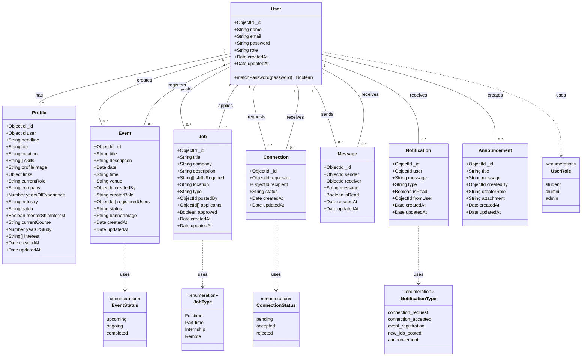

# Alumni Management System - Class Diagram

**Generated**: 2025-12-09T23:43:03.758Z
**Description**: Complete data model showing all entities, their attributes, and relationships

## Diagram

## Legend

- Solid lines represent associations
- Dotted lines represent dependencies
- Cardinality shown as 1, 0..*, etc.

## Notes

This diagram represents the MongoDB schema structure with Mongoose models
