# Alumni Management System - Use Case Diagram

**Generated**: 2025-12-09T23:43:03.759Z
**Description**: System functionality organized by user roles (Student, Alumni, Admin)

## Diagram

```mermaid
graph TB
    subgraph Actors
        Student((Student))
        Alumni((Alumni))
        Admin((Admin))
    end
    
    subgraph "Authentication"
        UC1[Register]
        UC2[Login]
    end
    
    subgraph "Profile Management"
        UC3[Create/Update Profile]
        UC4[View Profile]
        UC5[Search Profiles]
    end
    
    subgraph "Connection Management"
        UC6[Send Connection Request]
        UC7[Accept/Reject Request]
        UC8[View Connections]
    end
    
    subgraph "Event Management"
        UC9[Create Event]
        UC10[View Events]
        UC11[Register for Event]
        UC12[View Registered Users]
    end
    
    subgraph "Job Management"
        UC13[Post Job]
        UC14[View Jobs]
        UC15[Apply to Job]
        UC16[View Applicants]
    end
    
    subgraph "Communication"
        UC17[Send Message]
        UC18[View Messages]
        UC19[View Notifications]
    end
    
    subgraph "Announcements"
        UC20[Create Announcement]
        UC21[View Announcements]
    end

    
    %% Student connections
    Student --> UC1
    Student --> UC2
    Student --> UC3
    Student --> UC4
    Student --> UC5
    Student --> UC6
    Student --> UC7
    Student --> UC8
    Student --> UC10
    Student --> UC11
    Student --> UC14
    Student --> UC15
    Student --> UC17
    Student --> UC18
    Student --> UC19
    Student --> UC21
    
    %% Alumni connections
    Alumni --> UC1
    Alumni --> UC2
    Alumni --> UC3
    Alumni --> UC4
    Alumni --> UC5
    Alumni --> UC6
    Alumni --> UC7
    Alumni --> UC8
    Alumni --> UC9
    Alumni --> UC10
    Alumni --> UC11
    Alumni --> UC12
    Alumni --> UC13
    Alumni --> UC14
    Alumni --> UC16
    Alumni --> UC17
    Alumni --> UC18
    Alumni --> UC19
    Alumni --> UC20
    Alumni --> UC21
    
    %% Admin connections
    Admin --> UC1
    Admin --> UC2
    Admin --> UC3
    Admin --> UC4
    Admin --> UC5
    Admin --> UC9
    Admin --> UC10
    Admin --> UC12
    Admin --> UC13
    Admin --> UC14
    Admin --> UC16
    Admin --> UC20
    Admin --> UC21
```

## Legend

- Actors are shown as circles
- Use cases are shown as rectangles
- Lines indicate which actors can perform which use cases

## Notes

Students have limited access, Alumni can post jobs and create events, Admins have full access
