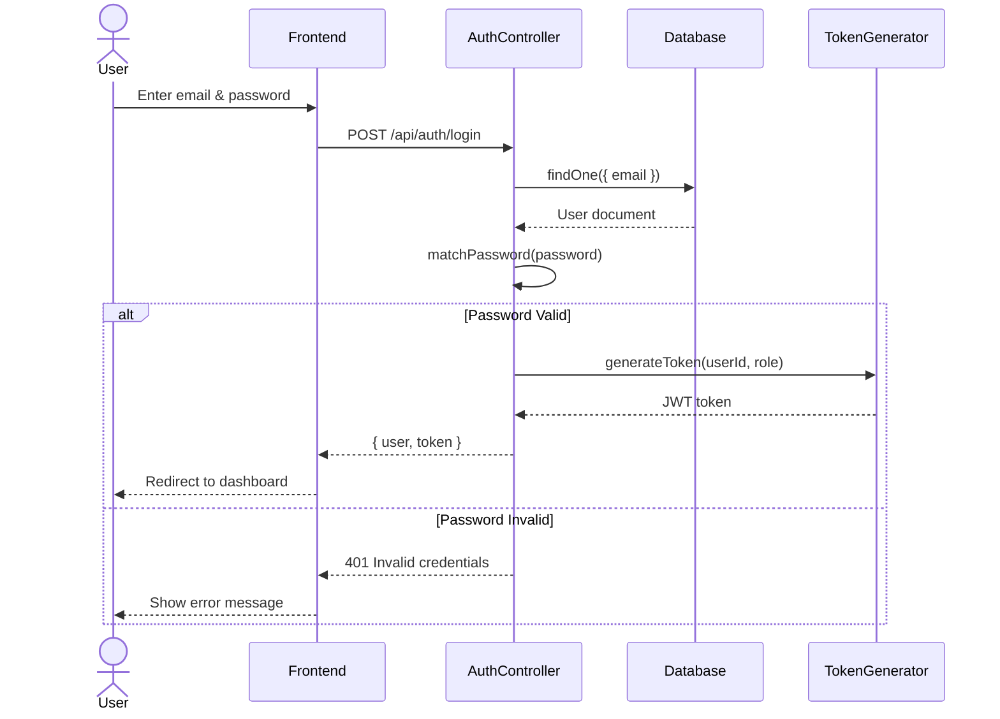

# User Login Sequence Diagram

**Generated**: 2025-12-09T23:43:03.760Z
**Description**: Detailed flow of user authentication process

## Diagram

## Legend

- Solid arrows represent synchronous calls
- Dashed arrows represent responses
- alt blocks show conditional logic

## Notes

JWT tokens are used for session management with 45-day expiration
