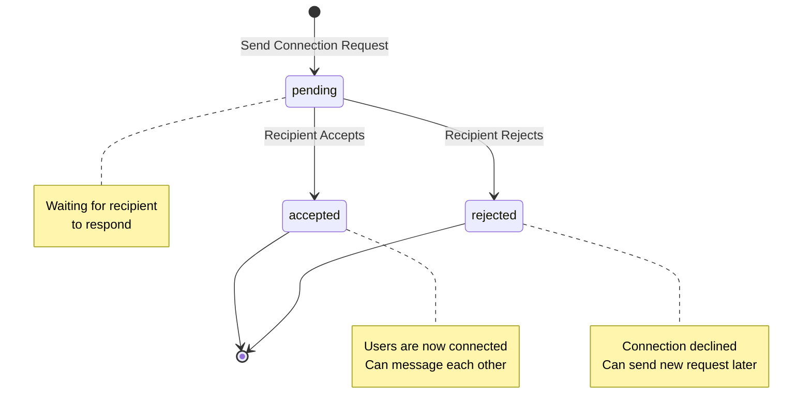

# Connection Status State Diagram

**Generated**: 2025-12-09T23:43:03.764Z
**Description**: State transitions for connection requests between users

## Diagram

## Legend

- Initial state: pending (when request is sent)
- Terminal states: accepted or rejected
- No transitions from terminal states

## Notes

Once a connection is accepted or rejected, the state is final. Users can send new requests if rejected.
