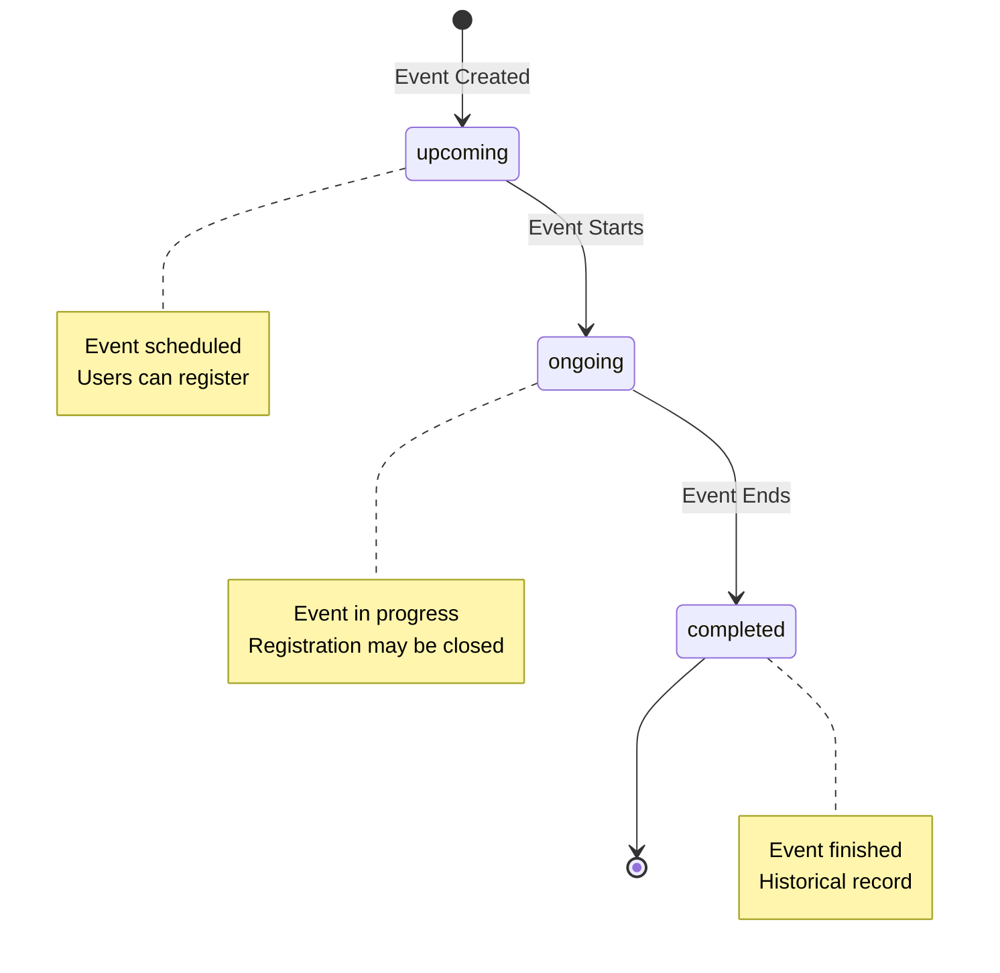

# Event Status State Diagram

**Generated**: 2025-12-09T23:43:03.765Z
**Description**: Lifecycle states of events from creation to completion

## Diagram

## Legend

- Linear progression through states
- Status typically updated manually by admin/creator
- Could be automated based on date/time

## Notes

Event status helps users identify which events they can register for and which have passed
