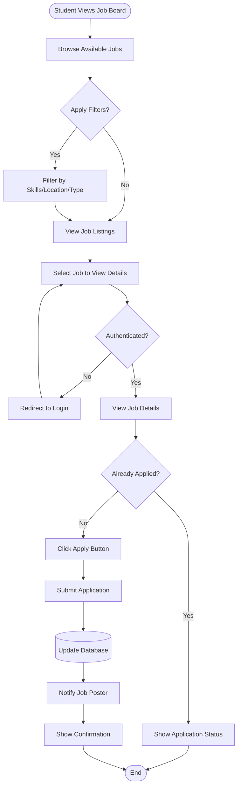

# Job Application Activity Diagram

**Generated**: 2025-12-09T23:43:03.766Z
**Description**: Complete workflow for students applying to job postings

## Diagram

## Legend

- Rounded rectangles represent start/end
- Rectangles represent activities
- Diamonds represent decision points
- Cylinder represents database operations

## Notes

Students must be authenticated to apply. Duplicate applications are prevented.
