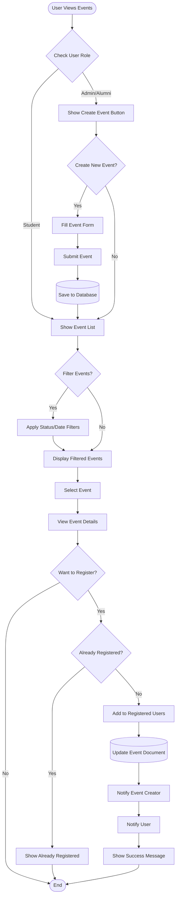

# Event Registration Activity Diagram

**Generated**: 2025-12-09T23:43:03.767Z
**Description**: Workflow for viewing, creating, and registering for events with role-based access

## Diagram

## Legend

- Shows different paths for different user roles
- Includes event creation and registration flows
- Demonstrates notification triggers

## Notes

Alumni and Admins can create events. All users can register for events. Duplicate registrations are prevented.
