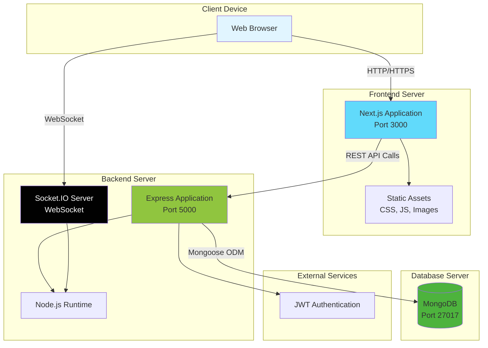

# System Deployment Diagram

**Generated**: 2025-12-09T23:43:03.776Z
**Description**: Physical deployment architecture showing servers, services, and communication protocols

## Diagram

## Legend

- Client Device: User's web browser
- Frontend Server: Next.js application serving React UI
- Backend Server: Node.js with Express API and Socket.IO
- Database Server: MongoDB for data persistence
- Communication: HTTP/HTTPS for API, WebSocket for real-time features

## Notes

The system can be deployed on separate servers or containerized. Frontend and backend communicate via REST API. Real-time features use WebSocket protocol.
