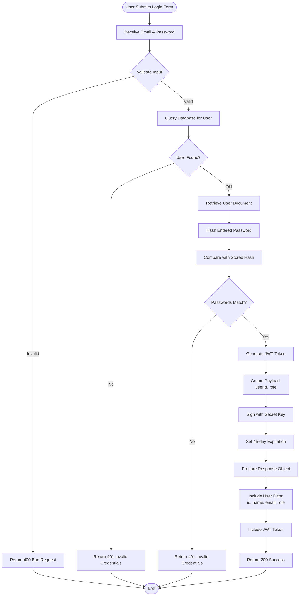

# Authentication Process Flowchart

**Generated**: 2025-12-09T23:43:03.777Z
**Description**: Detailed step-by-step flow of user login with validation and token generation

## Diagram

## Legend

- Diamond shapes represent decision points
- Rectangles represent processes
- Rounded rectangles represent start/end
- Shows all error paths and validation steps

## Notes

Password comparison uses bcrypt. JWT tokens include user ID and role for authorization. Tokens expire after 45 days.
