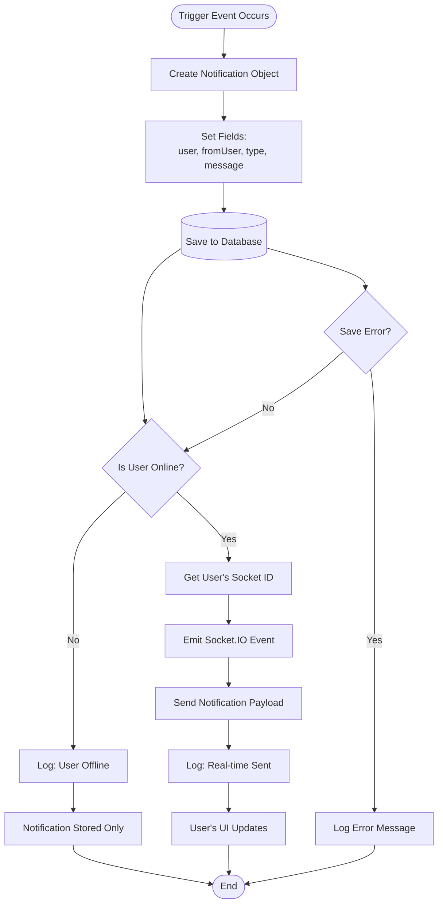

# Notification Delivery Flowchart

**Generated**: 2025-12-09T23:43:03.779Z
**Description**: Process flow for creating and delivering notifications with real-time and offline handling

## Diagram

## Legend

- All notifications are saved to database first
- Real-time delivery only if user is online
- Offline users see notifications when they log in
- Error handling for database failures

## Notes

The system maintains a global onlineUsers object mapping user IDs to socket IDs for real-time delivery.
