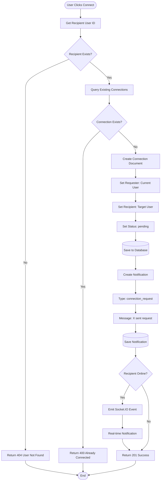

# Connection Request Process Flowchart

**Generated**: 2025-12-09T23:43:03.782Z
**Description**: Detailed flow for sending connection requests with validation and notification

## Diagram

## Legend

- Validates recipient exists before creating connection
- Prevents duplicate connection requests
- Creates notification for recipient
- Delivers real-time notification if recipient is online

## Notes

The system checks for existing connections in both directions (A->B or B->A) to prevent duplicates.
